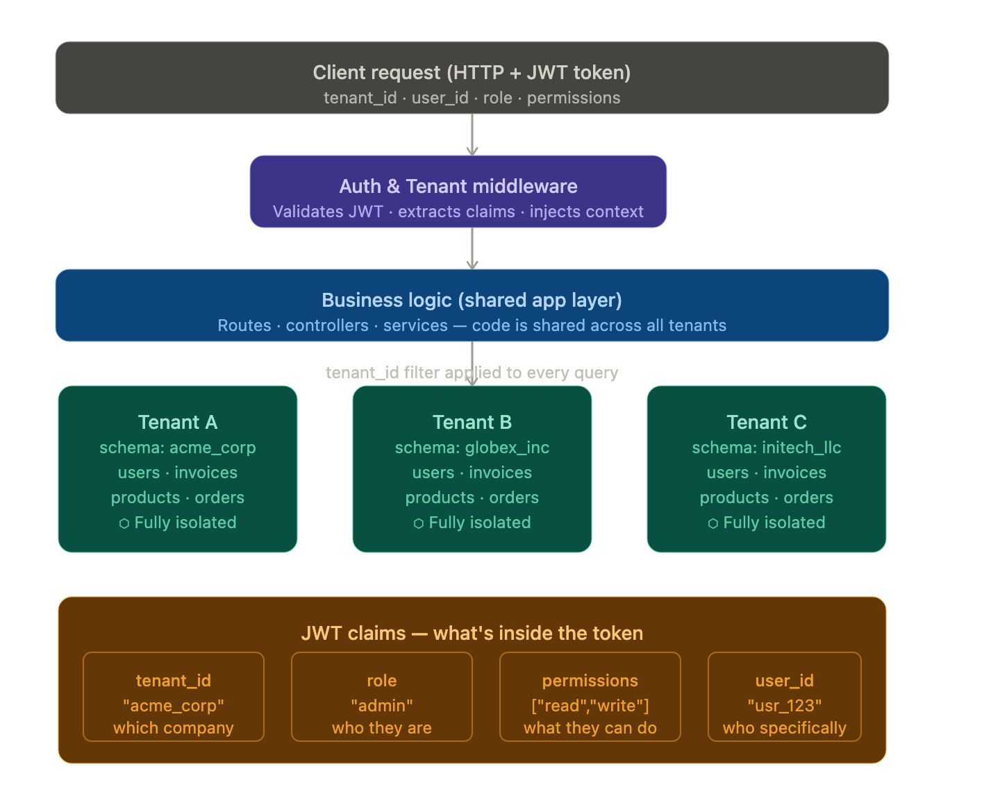

# MULTITENANT ERP API

Multitenancy means one application serves multiple independent clients ("tenants") — like an ERP used by Company A, B, and C — where each tenant's data is isolated from the others.

## Here's the architecture

## Here's the full breakdown of what's happening

- Multitenancy is the idea that one codebase and one running server handles many companies ("tenants"), but each tenant's data is completely invisible to others. The secret is req.db in the code — once the middleware runs, every controller only ever touches req.db, which is already pre-filtered to the right tenant. A developer cannot accidentally query another tenant's invoices.

- JWT Claims are the key/value pairs baked into the token when you log in. You're right that "claims" is the right term. The important ones for an ERP are tenant_id (which company), role (admin / accountant / viewer), and permissions (the flat list of what that role can do). Because these are in the token itself, your server doesn't need a DB roundtrip on every request to ask "can this user do X?" — you just check the claim.

- Roles vs Permissions is the distinction that matters most at scale. A role is a named bundle (like "accountant"), and permissions are the fine-grained actions (like "write" invoices). You assign roles to users, and roles expand into permissions. This way, when you want to give accountants the ability to delete draft invoices, you update the ROLES object once — not every user record.

The three middleware functions follow the exact order you always want: authenticate first (valid token?), tenantScope second (which company?), requirePermission last (allowed to do this?). Each one adds context that the next depends on.
