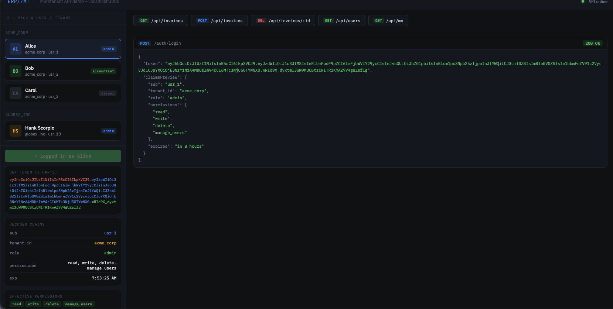
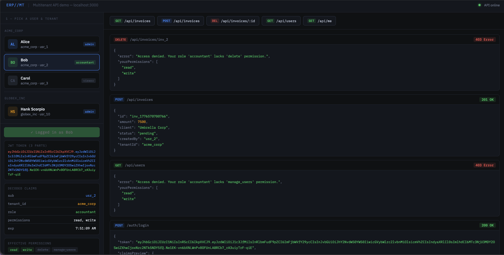
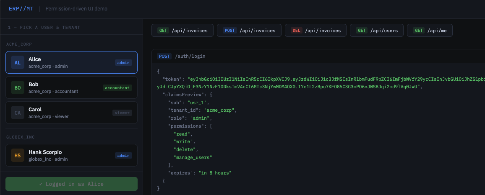
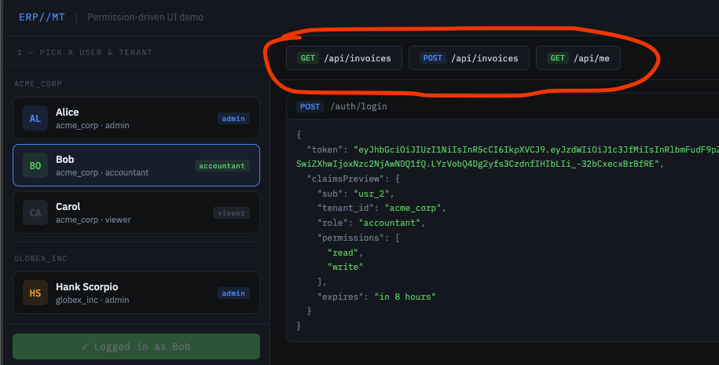
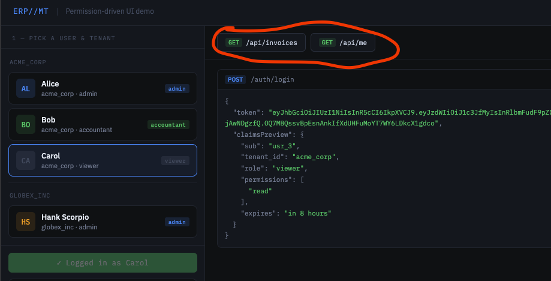

# Multitenant ERP — Frontend Demo

## Here's how every piece of the frontend maps to a concept

- Step 1 — User selection is purely local. No network call happens. The frontend just stores `userId` and `tenantId` in a JS variable. This simulates a login form.
- Step 2 — `Login (POST /auth/login)` is the first and most important request. The server responds with a JWT. The frontend then decodes it client-side (just `atob` on the middle segment — no library needed) to display the claims. Notice the three coloured parts of the raw token: red = header (algorithm), blue = payload (your claims), green = signature (server-only). The frontend can read the claims but cannot forge them — the signature would break.
- Step 3 — Every subsequent request simply attaches the token in an `Authorization: Bearer <token>` header. That's it. The server's middleware handles everything from there: reads the `tenant_id` claim to scope the database, reads `permissions` to gate access. The frontend knows nothing about how that works.
- The permission experiment is where it gets interesting. Log in as Carol (viewer) and `try POST /api/invoices` — you'll get a `403 Access denied` back immediately, because her token's `permissions` claim only contains `"read"`. Then log in as Hank (globex_inc admin) and hit `GET /api/invoices` — you'll see completely different invoices than Alice sees, even though it's the same endpoint, same code. That's multitenancy working.

> To run it: start the API with `node server.js`, then open the HTML file directly in your browser.

## Permission-driven UI

The frontend also uses the token's `permissions` claim to conditionally render UI elements. For example, the "Create Invoice" button only appears if the user has `"write"` permission. This is a simple form of permission-driven UI, where the server dictates not just data access but also what actions the user can see and perform.

## results

### Admin

### accountant

### Viewer

## Conclusion

This demo shows how a multitenant API can be designed with JWT-based authentication and role-based access control, while keeping the frontend simple and unaware of the underlying complexities. The server handles all tenant isolation and permission checks, allowing the frontend to focus on user experience.
